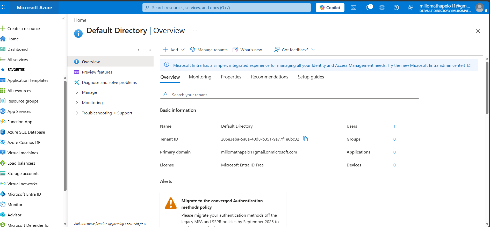
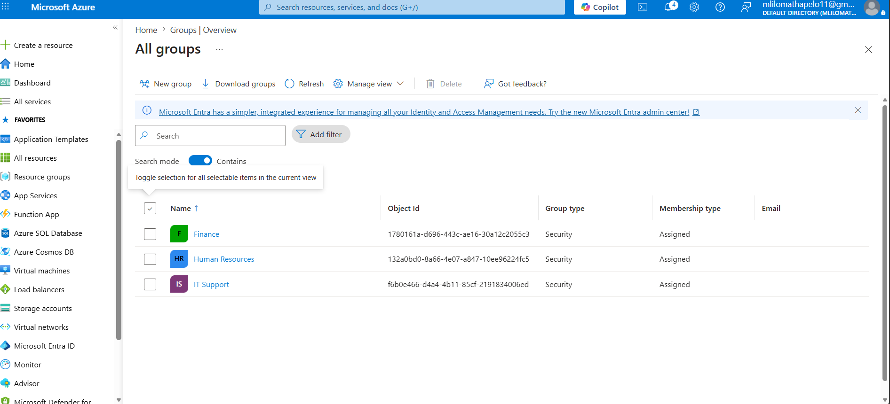
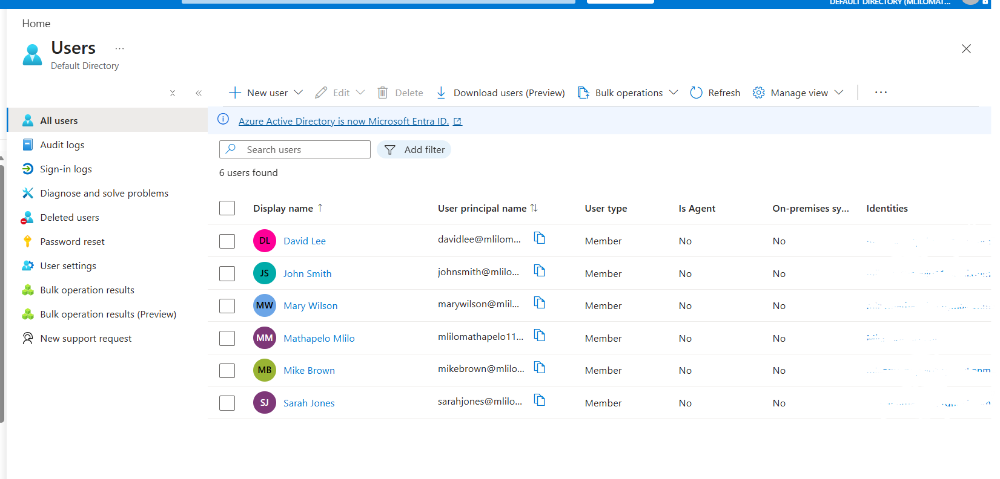
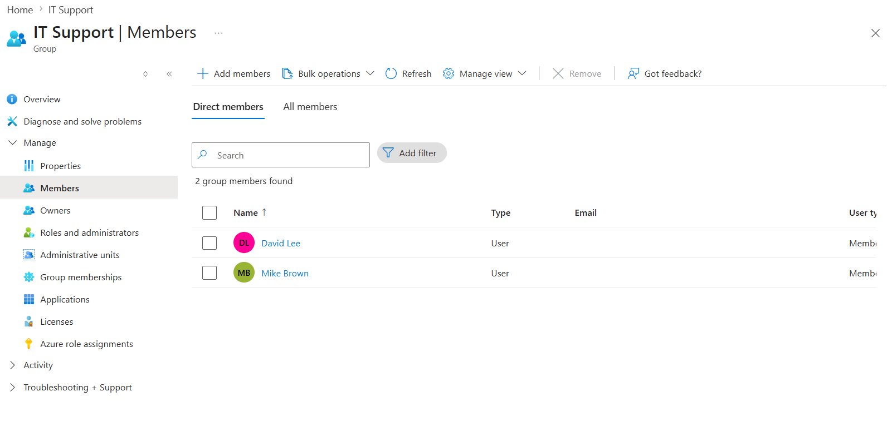
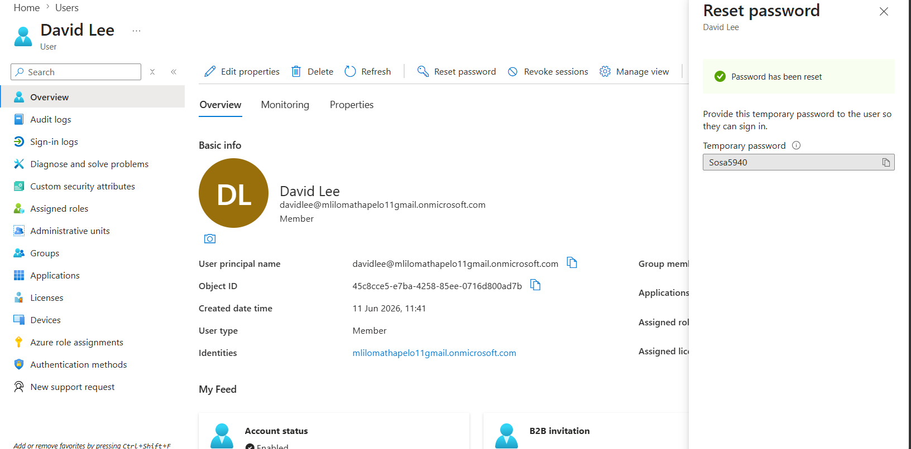
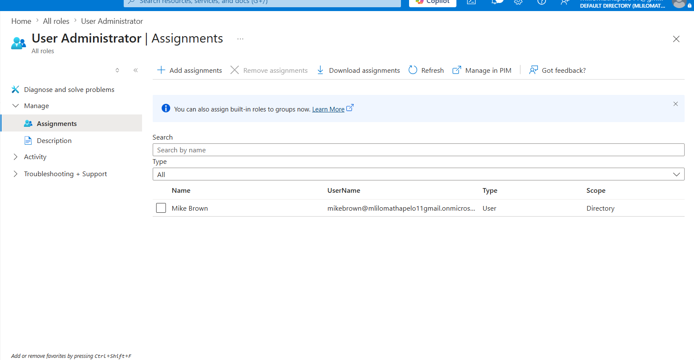
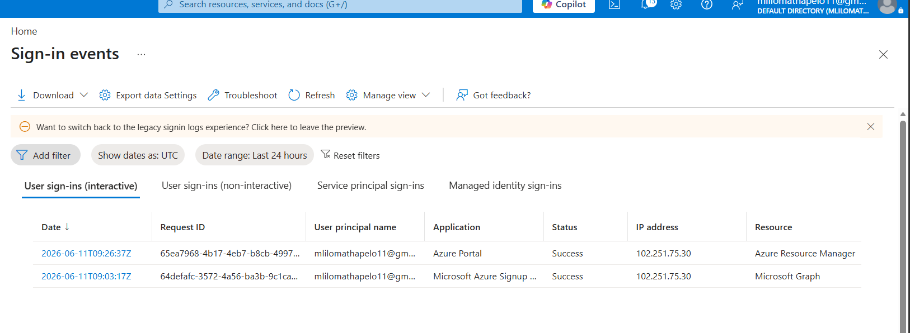

# Azure Entra ID Administration Lab

## Project Overview

This project demonstrates practical administration of Microsoft Entra ID (formerly Azure Active Directory) using the free tier of Microsoft Azure.

The objective of this lab was to gain hands-on experience with identity and access management tasks commonly performed by IT Support Technicians, System Administrators, and SOC Analysts.

---

## Technologies Used

* Microsoft Azure
* Microsoft Entra ID
* Identity and Access Management (IAM)
* Role-Based Access Control (RBAC)

---

## Lab Tasks Completed

### 1. Accessed Microsoft Entra ID

Configured and accessed a Microsoft Entra ID tenant through the Azure Portal.

### 2. Created Security Groups

Created departmental security groups:

* Human Resources
* Finance
* IT Support

### 3. Created User Accounts

Created and managed multiple cloud user accounts within Microsoft Entra ID.

### 4. Group Membership Management

Assigned users to appropriate departmental groups.

### 5. Password Administration

Performed password reset operations for user accounts.

### 6. Administrative Role Assignment

Assigned built-in administrative roles using Role-Based Access Control (RBAC).

### 7. Sign-in Monitoring

Reviewed sign-in logs to monitor authentication activity and security events.

---

## Skills Demonstrated

* User Administration
* Identity Management
* Access Control
* Role-Based Access Control (RBAC)
* Password Management
* Azure Administration
* Microsoft Entra ID Administration
* Security Monitoring

---

## Screenshots

### Microsoft Entra ID Dashboard

### Security Groups

### Users Created

### Group Membership Assignment

### Password Reset

### Role Assignment

### Sign-in Logs

---

## Learning Outcome

This project provided hands-on experience with Microsoft Entra ID administration, user lifecycle management, access control, and security monitoring using Microsoft Azure.

